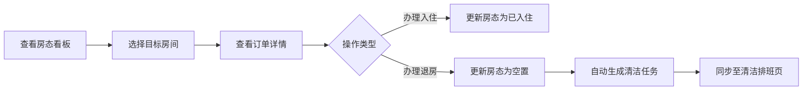
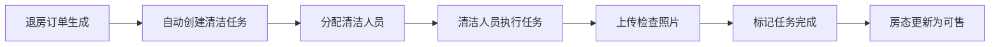
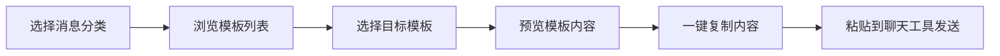

## 1. 产品概述

民宿管理系统是面向小型民宿经营者的一站式管理工具，提供房态管理、订单处理、清洁调度、消息模板和经营统计五大核心功能，帮助民宿主高效运营、提升服务质量和经营效率。

- 核心目标：解决小型民宿日常运营中的房态混乱、清洁调度不及时、客人沟通低效等痛点
- 目标用户：民宿店主、前台接待、清洁管理人员
- 产品价值：通过可视化看板和自动化流程，降低运营成本，提升客人入住体验

## 2. 核心功能

### 2.1 用户角色

| 角色 | 登录方式 | 核心权限 |
|------|----------|----------|
| 管理员/店主 | 账号密码登录 | 全部功能权限，数据统计查看 |
| 前台员工 | 账号密码登录 | 房态查看、订单管理、消息发送 |
| 清洁人员 | 账号密码登录 | 清洁任务查看、完成标记 |

### 2.2 功能模块

1. **房态看板页**：日历视图展示所有房间状态，支持日期切换和状态筛选
2. **订单详情页**：订单列表与详情，住客信息管理，特殊需求记录
3. **清洁排班页**：清洁任务列表，人员分配，完成状态追踪，照片上传
4. **消息模板页**：常用消息模板管理，支持分类和快速复制
5. **经营统计页**：入住率、平均房价、渠道占比等核心经营数据

### 2.3 页面详情

| 页面名称 | 模块名称 | 功能描述 |
|----------|----------|----------|
| 房态看板 | 顶部导航栏 | 页面切换、日期选择、今日概览数据 |
| 房态看板 | 房间日历矩阵 | 横向为日期、纵向为房间，格子显示入住/退房/空置/维修状态 |
| 房态看板 | 状态图例 | 四种状态颜色说明，点击可筛选 |
| 房态看板 | 房态卡片 | 悬浮显示当日房间详情，包含客人姓名、入住天数 |
| 订单详情 | 订单列表 | 按日期/状态筛选，搜索订单号/客人姓名 |
| 订单详情 | 订单详情卡片 | 住客信息、到店时间、押金、特殊需求、发票备注 |
| 订单详情 | 订单操作 | 新建、编辑、取消订单，办理入住/退房 |
| 清洁排班 | 任务时间轴 | 按退房时间排序的清洁任务列表 |
| 清洁排班 | 任务分配 | 选择清洁人员，设置预计完成时间 |
| 清洁排班 | 完成标记 | 标记任务完成，上传检查照片，填写备注 |
| 清洁排班 | 人员管理 | 清洁人员列表，工作负荷统计 |
| 消息模板 | 模板分类 | 入住指引、停车说明、延住提醒、退房提醒等分类 |
| 消息模板 | 模板列表 | 模板标题、预览内容、使用次数 |
| 消息模板 | 模板编辑 | 新建/编辑模板内容，支持变量占位符 |
| 消息模板 | 快速复制 | 一键复制模板内容到剪贴板 |
| 经营统计 | 数据概览卡片 | 入住率、平均房价、总营收、订单数等核心指标 |
| 经营统计 | 入住率趋势图 | 近30天入住率折线图 |
| 经营统计 | 渠道占比饼图 | 各预订渠道订单量占比 |
| 经营统计 | 房价趋势图 | 平均房价月度对比 |

## 3. 核心流程

### 3.1 房态管理流程
前台登录系统后，在房态看板查看当日所有房间状态。点击具体房间可查看订单详情，根据实际情况办理入住或退房，系统自动更新房态并同步至清洁排班。

### 3.2 清洁调度流程
系统根据退房时间自动生成清洁任务，管理员分配清洁人员，清洁人员完成后标记并上传照片，前台确认后房间恢复可售状态。

### 3.3 消息发送流程
前台在处理订单或与客人沟通时，可从消息模板库中选择合适模板，快速复制或编辑后发送给客人。

## 4. 用户界面设计

### 4.1 设计风格

**设计理念：温暖质感的民宿美学**

- **主色调**：暖木色 `#8B6914` 作为主色，传递温馨、舒适的民宿氛围
- **辅助色**：
  - 入住状态：鼠尾草绿 `#7CB342`，生机勃勃
  - 退房状态：珊瑚橙 `#FF8A65`，温暖醒目
  - 空置状态：雾灰色 `#B0BEC5`，中性平和
  - 维修状态：砖红色 `#E57373`，警示提醒
- **背景色**：米白色 `#FAF7F2` 搭配浅米色 `#F5F0E8`，营造温暖柔和的视觉感受
- **点缀色**：古铜金 `#C9A961`，提升品质感

**视觉元素：**
- 卡片式布局，圆角 12px，柔和阴影
- 木纹质感的装饰元素
- 手写风格的数字强调
- 细腻的微交互动画

### 4.2 排版与字体

- **标题字体**：使用衬线字体，传递典雅品质感
- **正文字体**：清晰易读的无衬线字体
- **数字字体**：等宽字体，数据展示更专业
- 字号层级清晰，标题 20-24px，正文 14-16px

### 4.3 页面设计概览

| 页面名称 | 模块名称 | UI 元素 |
|----------|----------|---------|
| 房态看板 | 日历矩阵 | 网格布局、状态色块、悬浮卡片、日期横向滚动 |
| 房态看板 | 顶部工具条 | 日期导航、筛选按钮、数据摘要、渐变色背景 |
| 订单详情 | 订单列表 | 卡片式列表、状态标签、客人头像、操作按钮 |
| 订单详情 | 详情抽屉 | 右侧滑出、信息分组、标签式布局 |
| 清洁排班 | 任务时间轴 | 纵向时间线、任务卡片、进度状态、人员头像 |
| 清洁排班 | 照片上传 | 缩略图网格、上传按钮、预览弹窗 |
| 消息模板 | 模板卡片 | 分类标签、预览文字、复制按钮、使用次数 |
| 消息模板 | 编辑弹窗 | 富文本编辑、变量插入、实时预览 |
| 经营统计 | 数据卡片 | 大号数字、趋势箭头、渐变背景、图标装饰 |
| 经营统计 | 图表区域 | 折线图、饼图、图例、数据悬浮提示 |

### 4.4 响应式设计

- 采用桌面端优先设计，适配 1280px 及以上宽度
- 平板端：侧边导航收起为图标模式，内容区自适应
- 移动端：底部导航栏，卡片堆叠布局，日历简化为周视图
- 触摸优化：按钮最小高度 44px，手势滑动切换日期

### 4.5 动效与交互

- 页面切换：平滑过渡动画，内容淡入
- 卡片悬浮：轻微上浮 + 阴影加深
- 状态变更：颜色渐变过渡动画
- 数据加载：骨架屏占位，内容渐显
- 按钮交互：按下时微缩反馈
