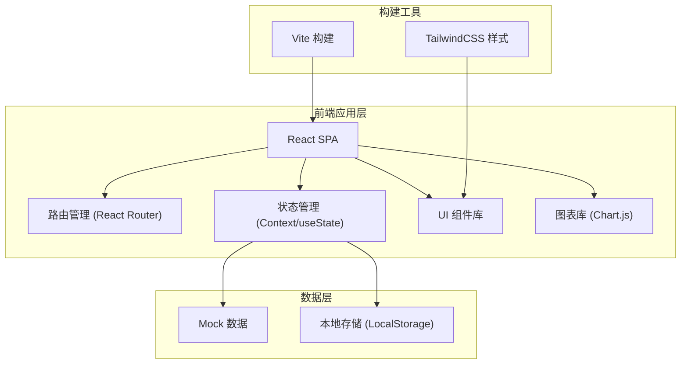
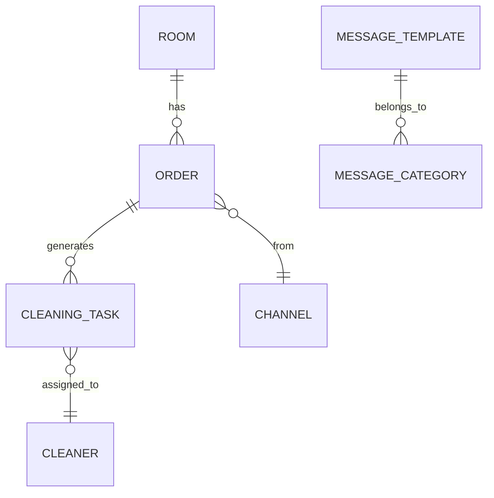

## 1. 架构设计

本项目为纯前端单页应用，使用 React + Vite 构建，数据使用 Mock 数据模拟，便于快速演示和后续对接后端 API。



## 2. 技术栈说明

### 2.1 核心技术

- **前端框架**：React@18 — 组件化开发，生态丰富
- **构建工具**：Vite@5 — 快速启动，热更新体验好
- **样式方案**：TailwindCSS@3 — 原子化 CSS，快速开发
- **路由管理**：React Router@6 — 单页应用路由
- **图表库**：Chart.js@4 + react-chartjs-2 — 数据可视化
- **图标库**：Lucide React — 轻量级图标组件

### 2.2 开发工具

- 语言：TypeScript — 类型安全
- 代码规范：ESLint + Prettier
- 包管理器：npm

### 2.3 数据方案

- 使用 Mock 数据模拟真实业务数据
- 支持 LocalStorage 持久化用户操作
- 预留 API 接口层，便于后续对接真实后端

## 3. 路由定义

| 路由路径 | 页面名称 | 说明 |
|----------|----------|------|
| `/` | 房态看板 | 默认首页，展示房间日历矩阵 |
| `/orders` | 订单详情 | 订单列表与详情管理 |
| `/cleaning` | 清洁排班 | 清洁任务排班与管理 |
| `/messages` | 消息模板 | 消息模板管理与复制 |
| `/statistics` | 经营统计 | 经营数据可视化 |

## 4. 目录结构

```
src/
├── assets/              # 静态资源
│   └── images/          # 图片资源
├── components/          # 公共组件
│   ├── Layout/          # 布局组件
│   │   ├── Sidebar.tsx  # 侧边导航
│   │   └── Header.tsx   # 顶部栏
│   ├── StatusBadge.tsx  # 状态标签
│   ├── DataCard.tsx     # 数据卡片
│   └── Modal.tsx        # 弹窗组件
├── pages/               # 页面组件
│   ├── Dashboard/       # 房态看板
│   ├── Orders/          # 订单管理
│   ├── Cleaning/        # 清洁排班
│   ├── Messages/        # 消息模板
│   └── Statistics/      # 经营统计
├── data/                # Mock 数据
│   ├── rooms.ts         # 房间数据
│   ├── orders.ts        # 订单数据
│   ├── cleaning.ts      # 清洁任务数据
│   ├── messages.ts      # 消息模板数据
│   └── statistics.ts    # 统计数据
├── types/               # TypeScript 类型定义
│   └── index.ts
├── utils/               # 工具函数
│   ├── date.ts          # 日期处理
│   └── format.ts        # 格式化函数
├── App.tsx              # 根组件
├── main.tsx             # 入口文件
└── index.css            # 全局样式
```

## 5. 数据模型

### 5.1 实体关系



### 5.2 数据类型定义

```typescript
// 房间
interface Room {
  id: string;
  name: string;
  type: string;      // 房间类型：大床房、双床房、套房等
  floor: number;
  price: number;     // 基础房价
  status: 'available' | 'occupied' | 'maintenance';
}

// 订单
interface Order {
  id: string;
  orderNo: string;
  roomId: string;
  guestName: string;
  guestPhone: string;
  guestIdNo: string;
  checkInDate: string;
  checkOutDate: string;
  checkInTime?: string;
  price: number;
  deposit: number;
  channel: string;   // 预订渠道
  status: 'pending' | 'checked_in' | 'checked_out' | 'cancelled';
  specialRequirements?: string;
  invoiceRemark?: string;
  createdAt: string;
}

// 清洁任务
interface CleaningTask {
  id: string;
  roomId: string;
  orderId: string;
  checkOutTime: string;
  assignedTo?: string;  // 清洁人员ID
  status: 'pending' | 'in_progress' | 'completed';
  photos: string[];     // 检查照片
  remark?: string;
  estimatedDuration: number; // 预计时长(分钟)
  completedAt?: string;
}

// 清洁人员
interface Cleaner {
  id: string;
  name: string;
  avatar?: string;
  phone: string;
  taskCount: number;    // 今日任务数
}

// 消息模板
interface MessageTemplate {
  id: string;
  title: string;
  content: string;
  category: string;     // 分类
  useCount: number;     // 使用次数
  variables: string[];  // 可用变量
  createdAt: string;
}

// 统计数据
interface DailyStats {
  date: string;
  occupancyRate: number;   // 入住率
  avgPrice: number;        // 平均房价
  revenue: number;         // 营收
  orderCount: number;      // 订单数
}
```

## 6. 核心功能实现方案

### 6.1 房态日历矩阵
- 使用 CSS Grid 布局构建日历网格
- 根据订单数据计算每日每间房的状态
- 支持日期范围选择，横向滚动查看更多日期
- 悬浮显示房间详情卡片

### 6.2 订单管理
- 列表展示所有订单，支持搜索和筛选
- 点击订单展开详情或打开侧边抽屉
- 表单编辑订单信息
- 状态变更带动画过渡效果

### 6.3 清洁排班
- 时间轴样式展示清洁任务
- 拖拽分配清洁人员
- 图片上传组件（base64 存储）
- 任务状态进度指示

### 6.4 消息模板
- 分类标签切换查看不同类型模板
- 模板卡片展示预览
- 编辑弹窗支持变量插入
- 一键复制到剪贴板

### 6.5 经营统计
- 使用 Chart.js 绘制折线图和饼图
- 数据卡片展示核心指标
- 支持时间范围切换
- 图表交互：悬浮显示详细数据

## 7. 性能与体验优化

- 路由懒加载，减少首屏加载时间
- 组件 memo 优化，避免不必要重渲染
- 列表虚拟滚动（数据量大时）
- 图片懒加载
- 平滑过渡动画，提升交互质感
